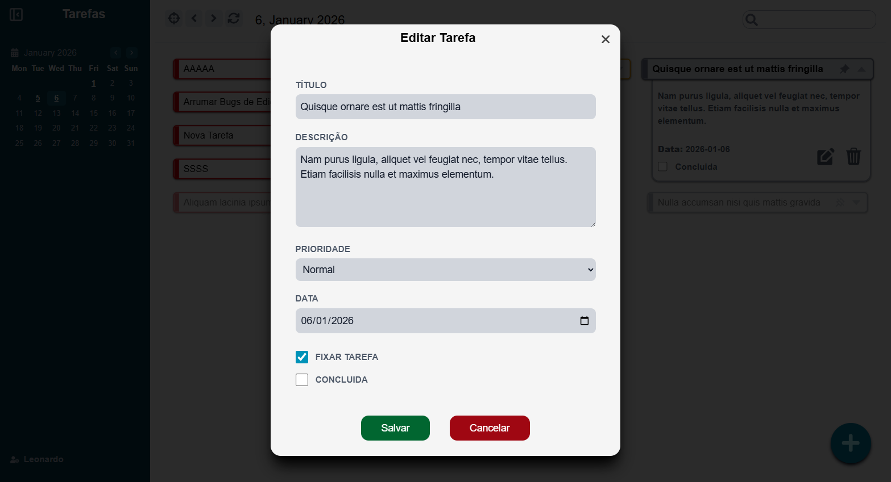

# Gerenciador de Tarefas

## Screenshots




## Tecnologias

- **Frontend:** React + Vite
- **Backend:** FastAPI + Python
- **Infraestrutura:** Google Cloud (Cloud Run + Cloud Storage)

## Bibliotecas Utilizadas

### Frontend

- **react-icons:** biblioteca de icons.
- **tailwindcss:** framework de estilização.
- **class-variance-authority:** gerenciamento de classes de estilização.
- **react-toastify**: biblioteca de notificação.

### Backend

- **fastapi:** construtor da API.
- **sqlalchemy:** ORM para o banco de dados.
- **pydantic:** validação de dados.

## Desenvolvimento Local

### Backend

```bash
cd backend
python -m venv venv
.\venv\Scripts\Activate.ps1
pip install -r requirements-dev.txt
uvicorn myapi:app --reload
```

### Frontend

```bash
cd frontend
npm install
npm run dev
```
